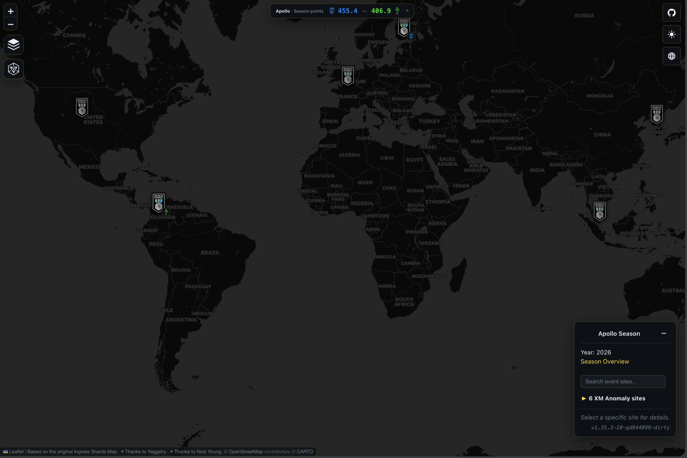

# Ingress Shards Map

Interactive React and Leaflet map of Ingress Shard data. The application is
written in TypeScript and uses Material UI for its responsive interface.

The map includes:

-   Shard jump JSON retrieved from the [Ingress Intel](https://intel.ingress.com/) site.
-   Series, site, Portal Ornament, Target Portal, score and Shard movement views.
-   English, Simplified Chinese and Traditional Chinese localisation.
-   Independent light and dark themes with matching CartoDB base layers.

This is a fork of [ingress-shards/ingress-shards.github.io](https://github.com/ingress-shards/ingress-shards.github.io). Thanks to [Yeggstry](https://github.com/Yeggstry) and [Nick Young](https://github.com/neon-ninja) for the original project this builds on.

The original MIT copyright and permission notice is retained in
[LICENSE](LICENSE).

## Series View

Displays all event sites for a selected series, including official season
points, event-type markers and faction results where available.

[](https://roastdot.github.io/ingress-shards.github.io/)

## Site View

Displays the detail of an individual shard site. Sites with multiple shards can be filtered on a per wave basis.

[](https://roastdot.github.io/ingress-shards.github.io/)

## Assumptions made

Distances are calculated with the [Haversine formula](https://rosettacode.org/wiki/Haversine_formula), using the Mean Earth Radius (6371km). General understanding is that Niantic uses the same calculation for distances.

The colour of each portal is based on the last relevant action which occurred at that portal. This is either:

-   The same colour of the last link which the shard jumped along.
-   The colour of the portal when the shard spawned (may be neutral).

Portal alignment at the time a shard despawns is deemed to be not relevant for display, however it is included in the history (hover over portal).

## Adding data to project

In order to ensure that new data is included on the shard map, the following configuration changes are required to the project:

-   For a new series, add a new entry in _conf/series_metadata.json_. See other entries for example properties available.
    -   Is it preferable to use the same series ID as Niantic use i.e. 2025-plusbeta for the +Beta series.
-   When Niantic publishes official season points, add or update the matching entry in _conf/series_results.json_. Keep each scoring programme (for example, `xm-anomaly` and `first-saturday`) separate and record its source URL, status and update date. `displayScore` defines the season points shown above the map and records which programmes contribute to them. Never calculate season points from shard and link counts in individual site data.
-   For new shard jump data, enter it in the relevant series folder in _data_. For example, the +Beta series files are located in _data/2025-plusbeta_.
    -   The jump files with a prefix of 'shard-jump-times-' will be automatically parsed and shards will be matched to the site (and date) within the series.

## Development

Requirements:

-   A current Node.js LTS release
-   Python 3
-   Python packages from `requirements.txt`

Install dependencies and start the development server:

```sh
python -m pip install --prefer-binary -r requirements.txt
npm install
npm start
```

Useful checks:

```sh
npm run typecheck
npm run validate
```

The UI entry point is `src/js/index.tsx`. React components are located in
`src/js/ui/react`, while Leaflet rendering remains under `src/js/ui`.

## Cloudflare Pages deployment

The production site is deployed through Cloudflare Pages Git integration.
Configure the Pages project with:

| Setting | Value |
| --- | --- |
| Production branch | The branch used for production deployments |
| Build command | `python -m pip install --prefer-binary -r requirements.txt && npm run build` |
| Build output directory | `dist` |
| Root directory | `/` |

Cloudflare automatically injects `CF_PAGES_BRANCH` and
`CF_PAGES_COMMIT_SHA`. Production builds use these values for the version shown
in the details panel, for example `main@d115305`. `APP_VERSION` can still be set
explicitly when a custom version label is required.

Cloudflare builds emit root-relative asset URLs (`/main.bundle.js`). Regular
non-Cloudflare production builds retain the GitHub Pages project subpath.

The build runs the geocoder, processes and validates the source data, performs
the statistics pass, and then bundles the React/TypeScript application with
Webpack.

## Third-party assets

The alternate Enlightened and Resistance faction symbols are adapted from
[cr0ybot/ingress-logos](https://github.com/cr0ybot/ingress-logos) and are
licensed under
[CC BY-NC-SA 3.0](https://creativecommons.org/licenses/by-nc-sa/3.0/).
Ingress names and faction marks belong to their respective trademark owners.

## Shards configuration

The configuration of the shards are available at the following locations:

-   [Series metadata](https://roastdot.github.io/ingress-shards.github.io/public/conf/series_metadata.json)
-   [Official series results](https://roastdot.github.io/ingress-shards.github.io/public/conf/series_results.json)
-   [Series geocode](https://roastdot.github.io/ingress-shards.github.io/public/conf/series_geocode.json)
-   [Map version](https://roastdot.github.io/ingress-shards.github.io/public/conf/version.json) (used to check for configuration updates)
